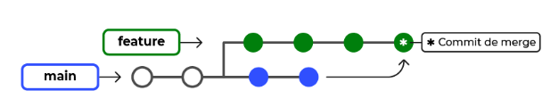
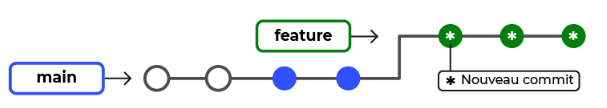
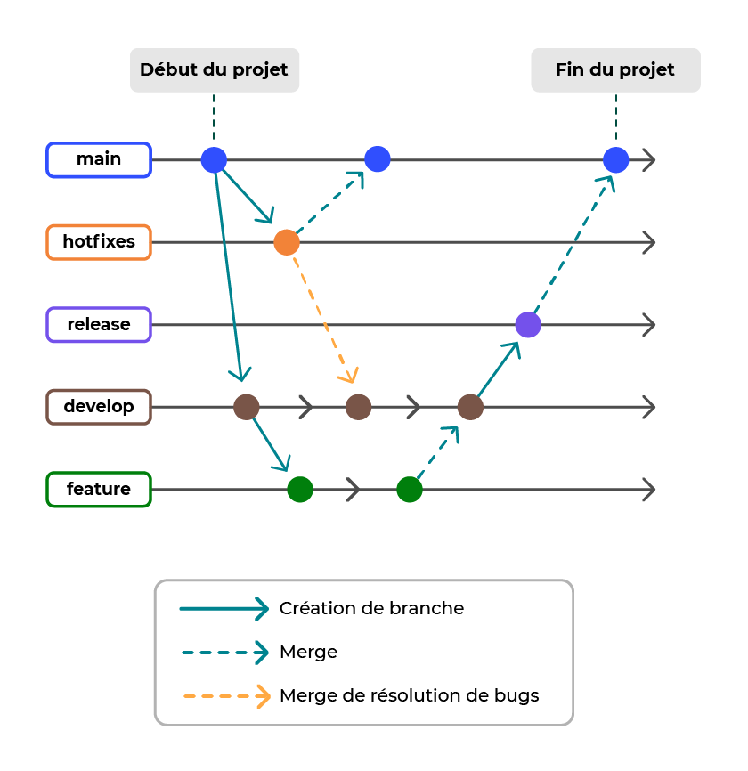

# Resolution de conflicts :

## pour conserver la version distante, on utilise la commande : 
		```
		$ git checkout --theirs <nom du fichier en conflict>
		$ git add <nom du fichier en conflict>
		$ git commit -m "Résolution de conflict"
		$ git push
		```		
	
## pour conserver la version locale, on utilise la commande :
```
$ git checkout --ours <nom du fichier en conflict>
$ git add <nom du fichier en conflict>
$ git commit -m "Résolution de conflict"
$ git push
```
	
## pour conserver une version mixte des deux, 
- on modifier les fichier de conflict en local
```	
$ git add <nom du fichier de conflict>
$ git commit "Résolution de conflict"
$ git push
```

# Corriger l'historique du projet au fil du développement
## Pour visualiser l'historique 
		$ git log

## En cas d'oublie d'un fichier lors d'un commit, la commande --amend sauve.  Exemple : 
modification de 2 fichiers : README.md et CONTRIBUTING.md ;
```
git add README.md ;
git commit -m "Mise à jour de README.md et CONTRIBUTING.md".

```
Oups ! On réalise notre erreur, nous avons oublié le fichier CONTRIBUTING.md :

```		
git add CONTRIBUTING.md ;
git commit --amend. 
```

## Au cas où la branche 'main' a été modifiée le temps qu'on évoluait sur une branche 'feature'
C'est un problème de point de départ, qu'il faudra prendre en compte dans sa branche sécondaire 'feature'

Et pour ça, c'est **git rebase** qui vient nous sauver la mise. 

Donc au lieu de faire ça 

On fait ça


### Exemple
On crée une branche **feature** à laquelle on ajoute un fichier *feature.txt*
``` 
driss@Drissa MINGW64 /c/DATA/CTheory4DS/Git_training/7688581-Expert-Git-GitHub (main)
$ git status
On branch main
Your branch is up to date with 'origin/main'.

nothing to commit, working tree clean

driss@Drissa MINGW64 /c/DATA/CTheory4DS/Git_training/7688581-Expert-Git-GitHub (main)
$ git checkout -b feature
Switched to a new branch 'feature'

driss@Drissa MINGW64 /c/DATA/CTheory4DS/Git_training/7688581-Expert-Git-GitHub (feature)
$ echo "feature" > feature.txt

driss@Drissa MINGW64 /c/DATA/CTheory4DS/Git_training/7688581-Expert-Git-GitHub (feature)
$ git add feature.txt
warning: in the working copy of 'feature.txt', LF will be replaced by CRLF the next time Git touches it

driss@Drissa MINGW64 /c/DATA/CTheory4DS/Git_training/7688581-Expert-Git-GitHub (feature)
$ git commit -m "feature.txt ajouté"
[feature d0e72d9] feature.txt ajouté
 1 file changed, 1 insertion(+)
 create mode 100644 feature.txt

driss@Drissa MINGW64 /c/DATA/CTheory4DS/Git_training/7688581-Expert-Git-GitHub (feature)
$ git checkout main
Switched to branch 'main'
Your branch is up to date with 'origin/main'.

driss@Drissa MINGW64 /c/DATA/CTheory4DS/Git_training/7688581-Expert-Git-GitHub (main)
$ git checkout feature
Switched to branch 'feature'
```
On vérifie l'historique de la branche **feature**
```
driss@Drissa MINGW64 /c/DATA/CTheory4DS/Git_training/7688581-Expert-Git-GitHub (feature)
$ git log
commit d0e72d9307f0cd56ffe05a227225749dfd220370 (HEAD -> feature)
Author: drissasagnon <dsagnon25@gmail.com>
Date:   Thu Oct 30 14:24:51 2025 +0100

    feature.txt ajouté

commit 61a0d8f54b42324308aaef00a5785945dfae0e9a (origin/main, origin/HEAD, main)
Merge: 074e1b0 7d912cf
Author: drissasagnon <dsagnon25@gmail.com>
Date:   Thu Oct 30 13:06:18 2025 +0100

    #4 Correction d'une faute de frappe


```

On bascule dans la branche **main** dans laquelle on ajoute une fichier *main.txt*
```
driss@Drissa MINGW64 /c/DATA/CTheory4DS/Git_training/7688581-Expert-Git-GitHub (feature)
$ git checkout main
Switched to branch 'main'
Your branch is up to date with 'origin/main'.

driss@Drissa MINGW64 /c/DATA/CTheory4DS/Git_training/7688581-Expert-Git-GitHub (main)
$ echo "main" > main.txt

driss@Drissa MINGW64 /c/DATA/CTheory4DS/Git_training/7688581-Expert-Git-GitHub (main)
$ git add main.txt
warning: in the working copy of 'main.txt', LF will be replaced by CRLF the next time Git touches it

driss@Drissa MINGW64 /c/DATA/CTheory4DS/Git_training/7688581-Expert-Git-GitHub (main)
$ git commit -m "main.txt ajouté"
[main fce51b4] main.txt ajouté
 1 file changed, 1 insertion(+)
 create mode 100644 main.txt
```
On rebascule sur la branche **feature** et on fait le **rebase** afin de pointer sur le nouveau point de départ correspondant à la dernière modification du **main**

```
driss@Drissa MINGW64 /c/DATA/CTheory4DS/Git_training/7688581-Expert-Git-GitHub (main)
$ git checkout feature
Switched to branch 'feature'

driss@Drissa MINGW64 /c/DATA/CTheory4DS/Git_training/7688581-Expert-Git-GitHub (feature)
$ git rebase main
Successfully rebased and updated refs/heads/feature.

driss@Drissa MINGW64 /c/DATA/CTheory4DS/Git_training/7688581-Expert-Git-GitHub (feature)
$ git log
commit cb233783cacab3c352a3a358eba0e13d602a9e80 (HEAD -> feature)
Author: drissasagnon <dsagnon25@gmail.com>
Date:   Thu Oct 30 14:24:51 2025 +0100

    feature.txt ajouté

commit fce51b42efebe8c51482d9d231c06588446f776e (main)
Author: drissasagnon <dsagnon25@gmail.com>
Date:   Thu Oct 30 14:26:49 2025 +0100

    main.txt ajouté

commit 61a0d8f54b42324308aaef00a5785945dfae0e9a (origin/main, origin/HEAD)
Merge: 074e1b0 7d912cf
Author: drissasagnon <dsagnon25@gmail.com>
Date:   Thu Oct 30 13:06:18 2025 +0100

    #4 Correction d'une faute de frappe

```


# Localiser et corriger un bug sans impacter la tâche courante
1. Mettre de côté le développement en cours;
2. Identifier le **commit** qui est à l'origine du bug
3. Annuler ce commit.
4. Reprendre le développement qui a été mis de côté.

- **git stash** permet de mettre de côté le développement en cours ;

- **git stash pop** permet de récupérer ce qui a été stashé ;

- **git bisect** (et ses options *start, good, bad, reset*) sert à identifier un commit problématique en parcourant l'historique ;

- **git revert** permet de créer un nouveau commit qui contient l'inverse du commit concerné, ce qui revient à annuler l'effet de ce dernier.

# ___________________________________PARTIE 2___________________________

# Structurer la collaboration grâce à GitFlow


Nous avons donc exécuté les commandes ci-dessous :

git flow init ;

git flow feature start issue5 ;

git add * ;

git commit -m "#5 implémentation de la fonctionnalité" ;

git flow feature finish issue5 ;

git flow release start 0.0.2 ;

git flow release finish '0.0.2'. 

En résumé
Les workflows Git permettent de normaliser l'utilisation de Git au sein d'une équipe ou d'un groupe de collaborateurs.

Les principaux workflows sont :

le workflow centralisé ;

le workflow basé sur la création de branches de fonctionnalités ;

le workflow basé sur le tronc ;

le workflow de duplication ;

le GitFlow.

GitFlow est un workflow répandu qui étend le workflow basé sur la création de branches de fonctionnalités, en normalisant les branches et les interactions entre elles.

Un plugin GitFlow donne accès à des commandes facilitant la mise en œuvre de GitFlow. 


# Automatisation de la gestion de projet avec hook

Les hooks permettent de lancer des scripts personnalisés, et ainsi d'effectuer des contrôles et des traitements lors des opérations Git.

Les hooks côté client sont les scripts exécutés sur votre repository local.

Les hooks côté serveur sont les scripts exécutés sur le repository distant.

Git fournit un ensemble de hooks utilisables et adaptables dans le répertoire .git/hooks.